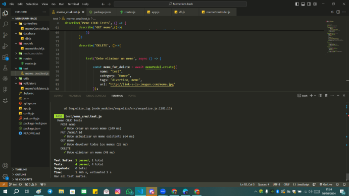

# Memerium Backend API 🏛️🎨

¡Bienvenido al backend de Memerium; **nuestro primer proyecto de backend** 🚀! Este proyecto gestiona los datos de las obras de arte y exposiciones que se realizan en Memerium; un museo de memes virtual (https://github.com/jfigueira87/Memerium). Este backend, ha sido diseñado para facilitar la creación, consulta, actualización y eliminación (CRUD) de información en nuestra base de datos, asegurando una experiencia fluida para los usuarios amantes del arte y la historia.


## 🚀 Tecnologías Utilizadas

- **Node.js**: Entorno de ejecución para JavaScript en el backend.
- **Express**: Framework para crear el servidor y manejar las rutas.
- **MySQL**: Sistema de gestión de bases de datos relacional.
- **Sequelize**: ORM (Object-Relational Mapping) para MySQL, que facilita la interacción con la base de datos.
- **Jest**: Framework para realizar pruebas unitarias.
- **SuperTest**: Herramienta para probar endpoints de la API.
- **MySQL Workbench**: Utilizado para gestionar la base de datos y realizar consultas.
- **Mydrawsql**: Herramienta para diseñar el diagrama de la base de datos.
- **Postman**: Utilizado para probar y documentar las rutas de la API.

## 📑 Funcionalidades Principales

- **CRUD de Obras de Arte**: Los usuarios pueden ver, añadir, editar y eliminar obras de arte.
- **Gestión de Exposiciones**: Control de las exposiciones del museo y las piezas que se muestran.
- **Validaciones**: Control estricto de los datos introducidos para evitar errores y mantener la integridad de la información.

## 🏗️ Estructura del Proyecto

museum-backend/
├── controllers/
│   └── memeController.js
├── database/
│   └── db.js
├── models/
│   └── memeModel.js
├── node_modules
├── routes/
│   └── routes.js
├── test/
│   └── mem.test.js
├── validators/
│   └── memeValidators.js
├── .env
├── .gitignore
├── app.js
├── config.js
├── jest.config.js
├── package.json
├── package-lock.json
└── README.md

## 🛠️ Instalación

1. Clona el repositorio:
```bash
 git clone https://github.com/tuusuario/museum-backend.git
 ```

2. Instala las dependencias:
```bash
 npm install
 ```

3. Configura las variables de entorno en el archivo .env.

4. Ejecuta las migraciones de la base de datos con Sequelize:
```bash
npx sequelize db:migrate
```

5. Ejecuta la aplicación:
```bash
 npm start
 ```

 ## 🧪 Testing


Para ejecutar las pruebas, usa el siguiente comando:
```bash
 npm test
```
Las pruebas verifican que los endpoints funcionan correctamente y validan las reglas aplicadas a los datos.



## 📈 Futuras Mejoras

- Implementar login de usuarios para una experiencia más personalizada.
- Añadir roles de usuuario para una gestión más detallada de permisos.
- Migrar la base de datos a MongoDB para una mayor escalabilidad y flexibilidad.

### Gracias por visitar nuestro backend... ¡donde el arte de programar es más antiguo que los dinosaurios del museo! 🦖🎨


